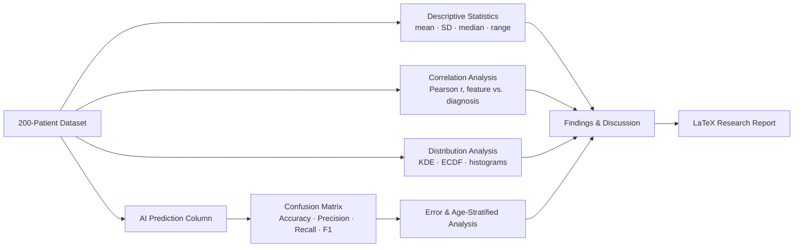

<div align="center">

# Machine-Assisted Diagnosis of Benign & Malignant Tumors
### A Feature-Based Statistical & Predictive Analysis

**Mosaddek Hossain Mehedi**
Department of Computer Science & Engineering — Dhaka International University

[](./Task03%20(CancerDetection).pdf)
[](./cancer_detection.tex)
[]()
[]()

</div>

---

## Overview

This repository contains a self-contained research study examining whether a small set of quantitative histopathological features can reliably separate **benign** from **malignant** tumors, and how well an AI-assisted classifier performs against ground-truth diagnoses on that basis.

The analysis is built on a 200-patient dataset described by six numeric features — age, tumor size, cell irregularity, mitotic count, vascularity, and texture — paired with a binary diagnosis label and a corresponding model prediction. Rather than proposing a new algorithm, the goal is to **rigorously ground feature-based cancer screening in transparent, interpretable statistics**: how cleanly the features separate diagnostic classes, which features carry the most signal, and where a predictive model succeeds or fails.

## Motivation

Tumor classification is one of the most consequential steps in a patient's clinical journey, and pathologist-driven visual assessment — while foundational — is known to carry meaningful inter-observer variability. This work sits in the growing body of literature applying data-driven, feature-based methods alongside expert judgment, with an emphasis on **interpretability over black-box performance**.

## Key Findings

| Aspect | Result |
|---|---|
| Cohort size | 200 patients (82 benign · 118 malignant) |
| Strongest single predictor | Mitotic count (*r* = 0.92 with diagnosis) |
| Classifier accuracy | **99.0%** (198 / 200 correct) |
| Precision / Recall (malignant) | 99.15% / 99.15% |
| Specificity | 98.78% |
| ROC–AUC | 1.000 |
| Errors | 1 false positive, 1 false negative — both in the mid-range 40–60 age overlap zone |

Every measured feature shifts consistently upward from benign to malignant cases, indicating the classes are separated by a **coordinated multi-feature signal** rather than any single fragile measurement — a reassuring property from a clinical-robustness standpoint.

## Methodology



**Pipeline stages:**
1. **Descriptive statistics** — feature means/SD grouped by diagnosis (benign vs. malignant).
2. **Correlation analysis** — Pearson correlation matrix across all six features, diagnosis, and AI prediction.
3. **Distributional analysis** — kernel density estimation and empirical CDFs to visualize class separability.
4. **Classifier evaluation** — confusion matrix, accuracy, precision, recall, specificity, F1-score, and ROC/AUC.
5. **Robustness check** — accuracy stratified by patient age bracket to surface systematic bias.

## Results at a Glance

| Feature | Benign (n = 82) | Malignant (n = 118) |
|---|---|---|
| Age (years) | 40.61 ± 3.47 | 58.42 ± 6.63 |
| Tumor Size (cm) | 1.03 ± 0.25 | 2.99 ± 0.88 |
| Cell Irregularity | 2.87 ± 0.79 | 6.75 ± 1.66 |
| Mitotic Count | 3.09 ± 0.95 | 7.66 ± 1.17 |
| Vascularity | 1.50 ± 0.50 | 4.03 ± 0.81 |
| Texture | 1.79 ± 0.70 | 5.97 ± 1.26 |

<div align="center">

| Confusion Matrix | Predicted Benign | Predicted Malignant |
|---|---|---|
| **Actual Benign** | 81 | 1 |
| **Actual Malignant** | 1 | 117 |

</div>

### Figures

The `figures/` directory contains all visualizations referenced in the paper:

| File | Description |
|---|---|
| `fig1_age_distribution.png` | Patient age distribution by diagnosis |
| `fig2_size_vs_irregularity.png` | Tumor size vs. cell irregularity, colored by diagnosis |
| `fig3_correlation_heatmap.png` | Pearson correlation matrix across all features |
| `fig4_confusion_matrix.png` | Ground truth vs. AI prediction heatmap |
| `fig5_feature_comparison.png` | Normalized mean feature comparison (benign vs. malignant) |
| `fig6_roc_curve.png` | ROC curve for the AI prediction model |
| `fig7_vascularity_mitotic.png` | Vascularity across mitotic count, by diagnosis |
| `fig8_accuracy_by_age.png` | Model accuracy stratified by age group |
| `fig9_kde.png` | KDE of tumor size vs. mitotic count |
| `fig10_ecdf.png` | Empirical CDF of tumor size by diagnosis |

## Repository Structure

```
CancerDetection/
├── cancer_detection.tex        # Full research paper (LaTeX source)
├── cancer_references.bib       # Bibliography (BibTeX)
├── Task03 (CancerDetection).pdf # Compiled paper
├── figures/                    # All generated plots (10 figures)
└── README.md
```

## Tech Stack

| Category | Tools |
|---|---|
| Statistical analysis & visualization | Python (pandas, NumPy, Matplotlib, Seaborn) |
| Classifier evaluation | scikit-learn (confusion matrix, ROC/AUC, precision/recall) |
| Manuscript typesetting | LaTeX (two-column IEEE-style layout), BibTeX |
| Version control | Git / GitHub |

## Limitations & Future Work

- The 200-patient cohort, while cleanly separated, is small relative to real-world clinical diversity; near-perfect separability may partly reflect dataset curation rather than true diagnostic difficulty.
- Imaging modality, biopsy technique, and inter-pathologist agreement are not captured by the six numeric features.
- Future work: validation on larger multi-institution cohorts, calibrated probability outputs for flagging borderline cases, robustness testing against inter-observer measurement noise, and fusion with image-derived deep learning features.

## Citation

If you reference this work, please cite the accompanying paper:

```bibtex
@unpublished{mehedi2026cancer,
  title  = {Machine-Assisted Diagnosis of Benign \& Malignant Tumors:
            A Feature-Based Statistical \& Predictive Analysis},
  author = {Mosaddek Hossain Mehedi},
  school = {Dhaka International University},
  year   = {2026}
}
```

## Disclaimer

This research was conducted using publicly available academic resources and AI-assisted research tools, alongside the author's own analytical work. Findings are exploratory and **not intended for clinical use**.

---

<div align="center">
<sub> MOSADDEK HOSSAIN MEHEDI · Department of Computer Science & Engineering · Dhaka International University</sub>
</div>
